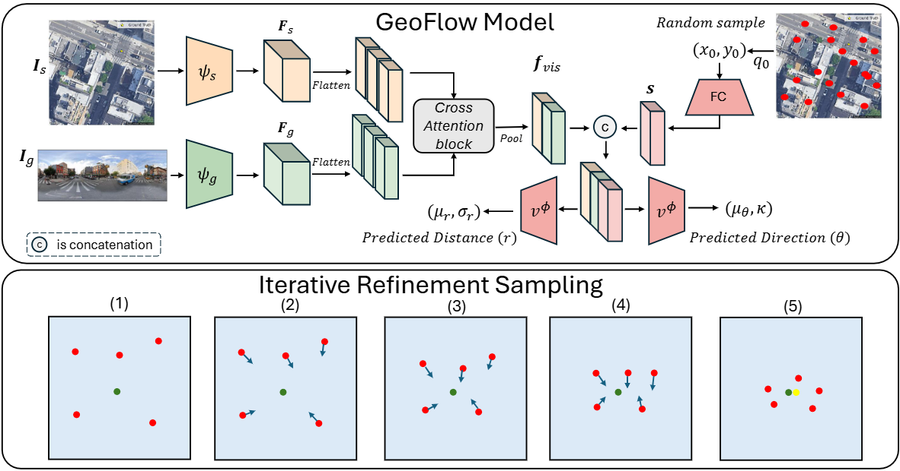

# GeoFlow

Official implementation of **GeoFlow: Real-Time Fine-Grained Cross-View Geolocalization via Iterative Flow Prediction**.

[Project page](https://ayeshabulehyeh.github.io/geoflow_page/) · CVPR 2026

<p align="center">
  
</p>

---

## Overview

GeoFlow is a lightweight framework for fine-grained cross-view geolocalization. The method formulates localization as an iterative flow refinement problem: the model extracts shared visual context once and then refines a coordinate estimate through lightweight updates.

The current public release focuses on the **KITTI** codebase. The **VIGOR** release will follow in a subsequent update.

---

## Released code

This repo includes implementations for the KITTI and VIGOR components of GeoFlow. Each component lives in its own directory (`kitti/`, `vigor/`) and contains the code needed to train and evaluate the corresponding models. Legacy compatibility wrappers are provided where useful to avoid breaking older scripts.

---

## Installation

Install the Python dependencies using the provided `requirements.txt`:

```bash
pip install -r requirements.txt
```
If you prefer a named environment, activate it first (example for conda):

```bash
conda create -n myenv python=3.10
conda activate myenv
pip install -r requirements.txt
```

---

## KITTI data preparation

The KITTI loaders expect the dataset to follow the existing GeoFlow directory layout and file lists used in the original project.

Expected list files:

- `train_files.txt`
- `test1_files.txt`
- `test2_files.txt`

Each entry should match the dataset indexing format used by the current loaders.

The dataset root is configured in [kitti/data.py](kitti/data.py).

---

## Training

### 1) Non-orientation model

Train the localization model with orientation provided by the pipeline:

```bash
python -m kitti.train \
  --train-list ./train_files.txt \
  --batch-size 128 \
  --epochs 200 \
  --backbone efficientnet_b0 \
  --d-model 128 \
  --use-augmentation
```

### 2) Orientation-aware model

Train the variant that predicts orientation jointly with localization:

```bash
python -m kitti.train_cross_orient \
  --train-list ./train_files.txt \
  --batch-size 128 \
  --epochs 200 \
  --backbone efficientnet_b0 \
  --d-model 128
```

### Checkpoints and logs

Each run writes to a timestamped directory under `checkpoints/` and stores:

- `best.pth` — best checkpoint by training loss
- `last.pth` — most recent checkpoint
- `epoch_###.pth` — periodic snapshots
- `config.json` — run configuration
- `train_log.txt` — human-readable training log

---

## Evaluation

Run the non-orientation evaluation:

```bash
python -m kitti.eval --model-path checkpoints/<run_name>/best.pth --test-set test2
```

Run the orientation-aware evaluation:

```bash
python -m kitti.testing_iterate_orient --checkpoint-path checkpoints/<run_name>/best.pth
```

Evaluation outputs are written to `inference_outputs/` as both text and JSON summaries.

---

## Planned release

The next public update will include:

- VIGOR code release
- Additional evaluation scripts and benchmark notes
- Pretrained checkpoints, when available

---

## Citation

If GeoFlow is useful for your research, please cite the paper once the final BibTeX entry is released on the project page.

